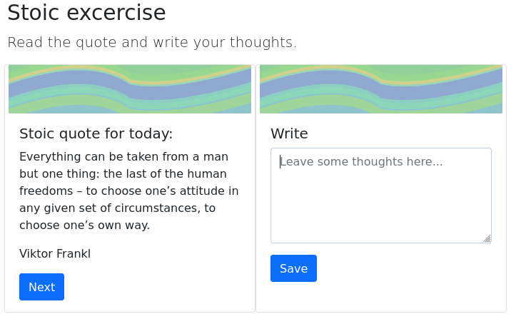
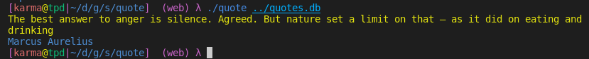
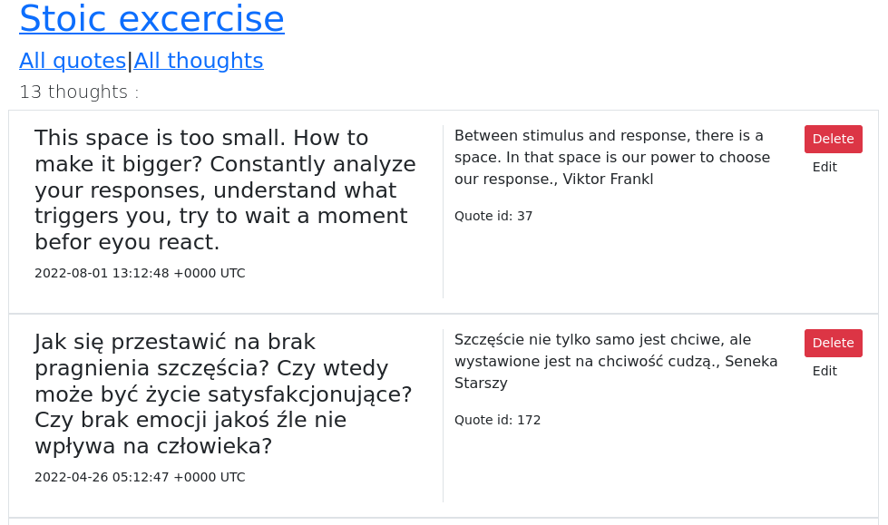
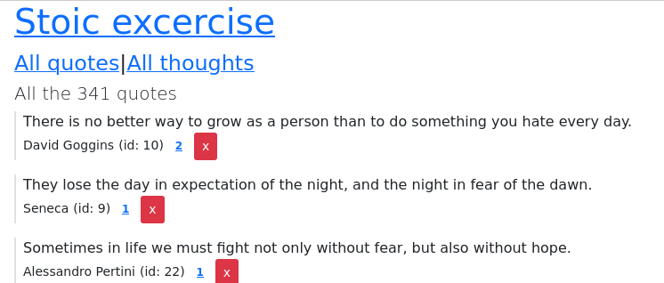
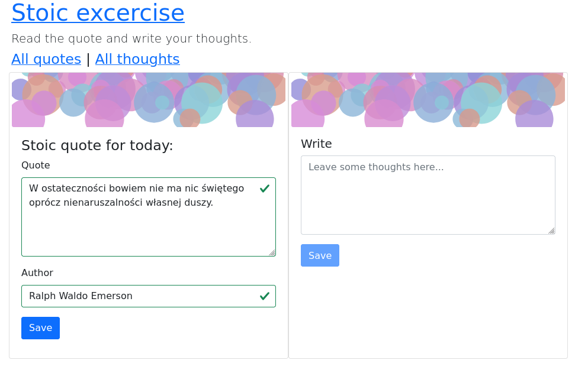

# What is it
Application for stoic meditation.

Its goal is to help practice stoicism by:
*  providing quotations
*  allowing user to add own quotations
*  recording user's thoughts (notes) related to those quotations


# Source of quotes
* Quotes in English taken from [kidadl.com](https://kidadl.com/quotes/best-stoic-quotes-for-budding-philosophers-to-study)
* Quotes in Polish taken from: [rosnijwsile.pl](https://rosnijwsile.pl/stoicyzm-najlepsze-stoickie-cytaty-mysli-filozofia-stoikow-zenon-z-kition-seneka-epiktet-marek-aureliusz/)

# Main view


# Usage

## Providing quotations: read command
Command `read` in read/ directory reads standard input formated as a sequence of quote and author (in separate lines) separated by a newline.
The quote is expected to be enclosed in double quotes.
The author is expected to start with hyphen ("-").

Usage:
`./read/read -dbpath quotes.db < sayings.txt`

### Example contents of expected input

    Freedom is the only worthy goal in life. It is won by disregarding things that lie beyond our control.
    -Epitectus

    Another quote
    -Author

## Reading random stoic quotation 
Command `quote` in quote/ directory prints random quote to stdout.

Usage:
```
$ ./quote/quote quotes.db
```

Result:


```
[karma@tpd|~/d/g/s/quote]  (web) λ ./quote ../quotes.db
The best answer to anger is silence. Agreed. But nature set a limit on that — as it did on eating and drinking
Marcus Aurelius
[karma@tpd|~/d/g/s/quote]  (web) λ
```
## browse command
Command `browse` in browse/ directory starts local http server on port 5000 and allows to browse quotes, view the list of quotes and record user's thoughts.

Usage: 
```
$ ./browse/browse quotes.db
```
# Other views
### Viewing thoughts


### Viewing quotes


### Adding new quotation


# Implementation details
* `repository.go` defines  Repository interface for data access
* SqliteRepository in `stoicdb/impl.go` is a struct that implements the repository with sqlite  database
* `model/model.go` contains structs which act as simple data model


