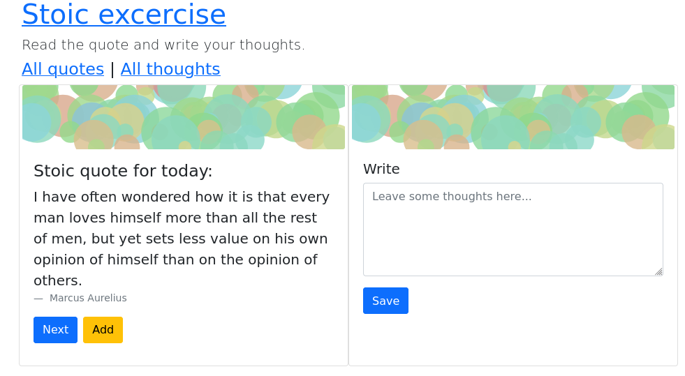

# What is it
Stoic practice app.
Quotes taken from: 
https://kidadl.com/quotes/best-stoic-quotes-for-budding-philosophers-to-study

# Screenshot

# Usage

## read command
Command `read` in read/ directory reads standard input formated as a sequence of quote and author (in separate lines) separated by a newline.
The quote is expected to be enclosed in double quotes.
The author is expected to start with hyphen ("-").

Usage:
`./read/read -dbpath quotes.db < sayings.txt`

### Example contents of expected input

    200."Freedom is the only worthy goal in life. It is won by disregarding things that lie beyond our control."
    -Epitectus

    "Another quote"
    -Author

## quote command
Command `quote` in quote/ directory prints random quote to stdout.

Usage:
`./quote/quote quotes.db`

## browse command
Command `browse` in browse/ directory starts local http server on port 5000 and allows to browse quotes (one by one) and add comments.

Usage: 
`./browse/browse quotes.db`

# TODO

* save new quotes
* display a list of quotes (and show selected in a card)
* display a list of thoughts (and show selected one in a card, ready to edit)
* add i18n 
* refactor to allow for different storage mechanisms (e.g. to text file)
* possibly: add other stoic excercises
* possibly: add sections for morning review and evening review (with helper questions)
* make review in console! for fast access
